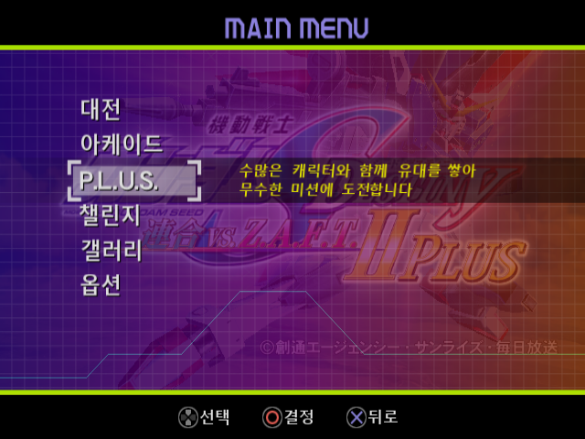
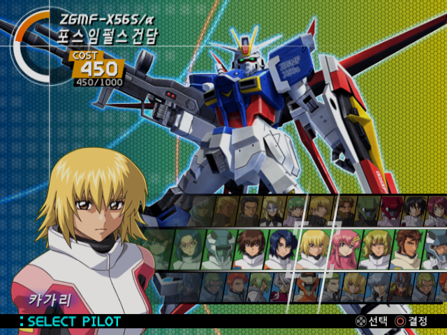
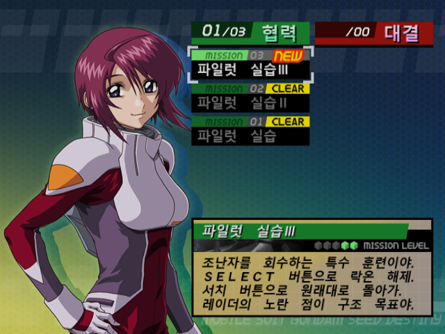
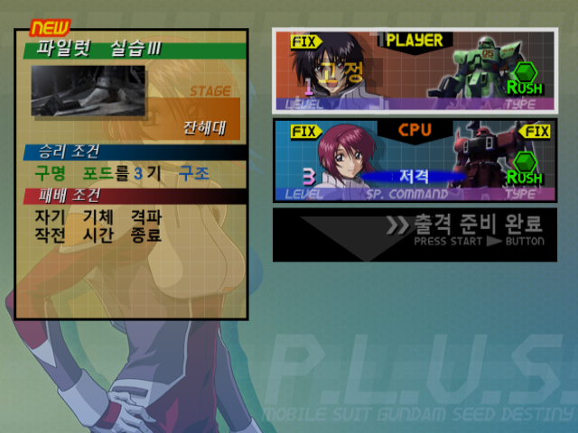
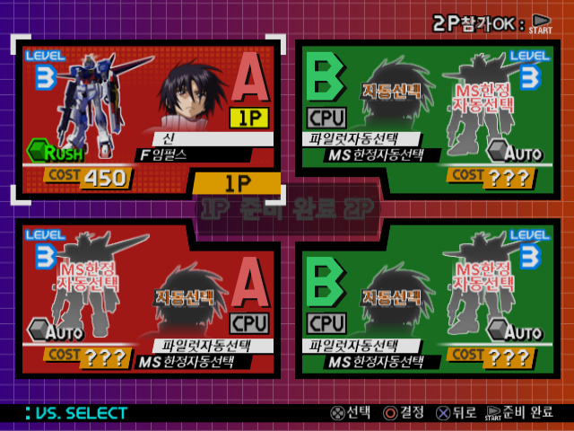
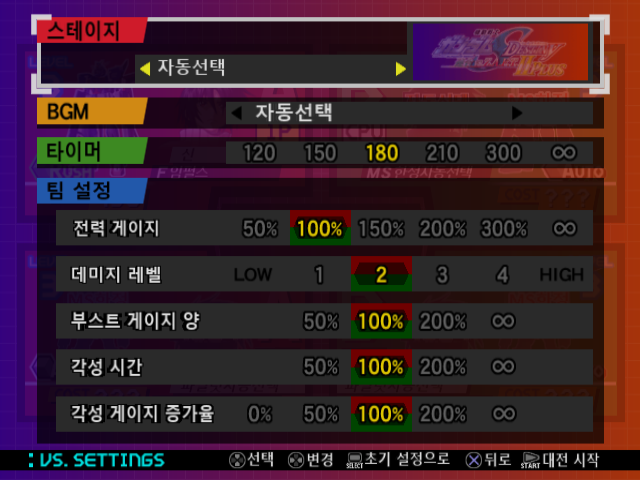
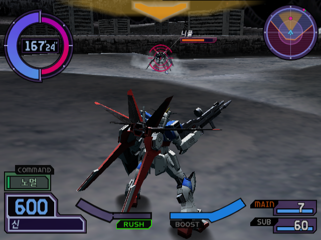
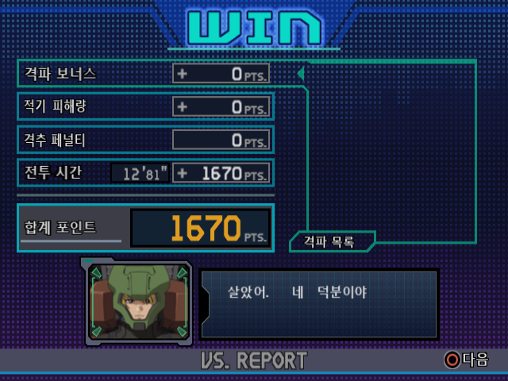
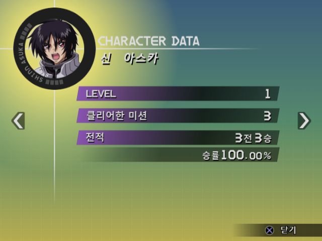
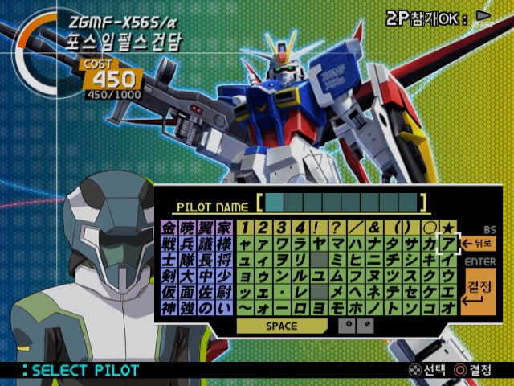

# 기동전사 건담 SEED DESTINY 연합 vs. Z.A.F.T. II PLUS — 한글 패치

PS2 『機動戦士ガンダムSEED DESTINY 連合 vs. Z.A.F.T. II PLUS』(SLPS-25718) 한국어 패치.

**v0.9** · 2026-08-20

**이 리포에는 패치 파일만 있습니다.** 게임 이미지는 들어 있지 않고, 앞으로도
올라가지 않습니다. 본인이 가진 정품 디스크의 덤프에 씌워 쓰세요.

---

## 화면

| | |
|---|---|
| <br>메인 메뉴 | <br>SELECT PILOT — 기체 이름판·파일럿 이름 |
| <br>P.L.U.S. 미션 선택 | <br>P.L.U.S. 브리핑 |
| <br>VS SELECT | <br>VS SETTINGS |
| <br>전투 화면 | <br>VS REPORT |
| <br>CHARACTER DATA | <br>이름 입력 자판 |

전부 v0.9 빌드에서 찍은 것입니다.

---

## 받는 것

**[→ Releases 에서 받으세요](https://github.com/Leedius/hanpatch-gundam-seed-vs-zaft2-plus/releases/latest)**

| 파일 | 크기 | SHA-256 |
|---|---|---|
| `GundamSEEDDestiny_VS_ZAFTII_Plus_KR_v0.9.xdelta` | 8,408,289 B | `c759ada3a71e09d804e8ad96ab4390678c6ceebbde06280d8463823d9aefa1e3` |

## 씌울 대상 (일본판 원본 ISO)

| 항목 | 값 |
|---|---|
| 크기 | 4,137,877,504 B |
| MD5 | `b69812eb4014a234a4653baa9966c368` |
| SHA-256 | `8ebc19acbaaaa5f816b73079083003469cc11c49f7cd7709937b4cff13522cd3` |

**해시가 다르면 다른 덤프입니다.** 그대로 씌우면 실행되지 않는 ISO 가 나옵니다.
덤프 방식(전체 이미지 / 트랙 분리)에 따라 크기부터 다를 수 있어요.

## 씌우는 법

### GUI — Delta Patcher (쉬움)

1. **Delta Patcher** (Marco Calautti) 또는 브라우저에서 도는
   [RomPatcher.js](https://www.marcrobledo.com/RomPatcher.js/) 를 엽니다.
2. `Original file` 에 원본 ISO, `XDelta patch` 에 이 `.xdelta` 파일을 고릅니다.
3. `Apply patch` 를 누릅니다.

### CLI — xdelta3

```
xdelta3 -d -f -s "원본.iso" GundamSEEDDestiny_VS_ZAFTII_Plus_KR_v0.9.xdelta "한글판.iso"
```

## 씌운 뒤 확인

결과 ISO 가 아래와 같아야 합니다.

| 항목 | 값 |
|---|---|
| 크기 | 4,137,877,504 B (원본과 같음) |
| MD5 | `3cf8152bc9d87f6518849e324d3ab29b` |
| SHA-256 | `4c34ca7d85d3d61e0932f10705f31b5585f77f8973cea93b87dfb7a47d75da11` |

```
certutil -hashfile "한글판.iso" SHA256      # Windows
sha256sum "한글판.iso"                       # Linux / macOS
```

이 값이 다르면 원본이 다르거나 패치가 제대로 안 씌워진 것입니다. 게임을 켜 보기 전에
먼저 확인하세요.

---

## 진행 상황

| 항목 | 수량 | 상태 |
|---|---|---|
| 실행파일 문자열 | 표 8개 · **3,318줄** | **100%** — 포인터를 따라가 확인, 아직 원문인 줄 **0** |
| 화면에 구워진 그림 글자 | **290장** · 문구 641개 | **100%** — 전부 한글로 다시 그림 |
| 사람이 다시 읽고 고친 줄 | **811줄** | 오역·용어 통일·조사·띄어쓰기 |
| 자동 검사(관문 감사) | **107개** | **전부 통과** |
| 실기 확인 | 화면 대부분 | 아래 「알려진 것」의 목록만 미확인 |

**대략 95%** 로 보면 됩니다. 안 된 5%는 「글자가 없다」가 아니라
**「실기로 직접 못 띄워 본 화면」과 「자리·크기 다듬기」** 입니다.

---

## 무엇이 한글이 됐나

- 메인 메뉴 / 옵션 / 게임 설정 / 버튼 설정 / 종합 성적
- 아케이드 전 구간 — SELECT ROUTE·MOBILE SUIT·PILOT, BRIEFING, 결과, SCORE RANKING
- VS 모드 — SELECT, SETTINGS, REPORT
- P.L.U.S. 모드 — 프롤로그, 지도, CHARACTER DATA, 미션 목록·브리핑, 부대 편성, 리절트
- CHALLENGE 모드 전 구간
- 전투 중 콕핏 HUD, 아군 지시(COMMAND), 승패 조건 표시, 파트너 통신
- 기체 로딩 화면(무기 설명·조작 안내), 해금 알림, 스테이지 이름판
- 갤러리 (인물·기체 소개 본문, 무비·아트워크·사운드 목록 포함)
- 메모리카드 안내문, 이름 입력 자판
- 파일럿 이름 — 짧은 이름·풀네임 모두, **SELECT PILOT 이름 라벨 포함**
- 기체 이름 — 짧은 이름과 **`SELECT MOBILE SUIT` 위쪽의 큰 이름판까지**

## v0.5 에서 달라진 것

v0.5 는 2026-08-11 빌드입니다. 그 뒤로 113회 고쳤고, 큰 것만 추리면 이렇습니다.

### 남아 있던 일본어를 지웠다

- **`SELECT MOBILE SUIT` 큰 기체 이름판.** v0.5 README 에 「이것만은 일본어로
  남는다」고 적어 뒀던 자리입니다. 이 이름은 문자열이 아니라 게임 데이터에
  **기체마다 구워 둔 사각형 좌표 목록**이라 번역할 글자 자체가 없었습니다.
  좌표와 UV 를 통째로 다시 써서 한글 조각을 붙였습니다.
- **`SELECT PILOT` 왼쪽 아래 파일럿 이름 라벨.** 「白星化ヌヲ」처럼 깨져
  나오던 자리입니다. 이 화면만 **네 번째 문자표**를 쓰는데 아무도 그걸 몰라서,
  다른 작업이 그 표가 가리키는 글자 칸을 덮어쓰고 있었습니다.
- **전투 중 승패 조건 표시**(「적 전력 게이지 제로」 등)가 브리핑과 다른
  문자표를 써서 원문 그대로였던 것.
- **기체 로딩 화면**의 무기 설명·조작 안내, **해금 알림** 70장,
  **스테이지 이름판** 네 벌.

### 깨져 보이던 것을 고쳤다

- 전투 화면 왼쪽 아래 파일럿 이름이 한 글자만 나오던 것.
- 글자 테두리가 검정이 아니라 회색이라 둘레가 뿌옇게 뜨던 자리 11곳.
- VS REPORT 「협력」·「대결」에서 한 낱말인데 앞 글자만 딱딱한 검은 테두리라
  두 서체처럼 보이던 것.
- 스테이지 썸네일 「자원위성」의 획이 원본의 절반 두께라 사진 위에서 안 읽히던 것.
- `%d` 자리에 한글 음절이 얹혀 「구명 포드를격기 구조」로 나오던 것.
- 시트 크기가 1~2px 어긋나 글자가 이웃보다 크거나 작던 자리 수십 곳.

### 번역을 다시 읽었다

기계 번역 티가 나는 자리를 811줄 고쳤습니다. 같은 원문이 화면마다 다르게
옮겨진 것(「사령부/지휘부/본부」, 「스카이글래스퍼/스카이그라스퍼」,
「자쿠/자크」), 다른 원문이 한 줄로 뭉친 것(「ご苦労様」과 바로 다음 줄
「お疲れ様」이 둘 다 「수고했어」), 받침을 안 본 조사(「신가 레벨업」),
낱말이 줄 가운데서 갈린 것 따위입니다.

### 검사를 늘렸다

빌드마다 도는 자동 검사가 v0.5 때 23개에서 **107개**가 됐습니다. 「글자가
상자를 넘었나」·「테두리를 뺐나」·「같은 낱말인데 화면마다 다른가」처럼
사람이 눈으로 놓치는 것을 기계가 먼저 잡습니다.

---

## 알려진 것

- **아직 실기로 직접 못 띄워 본 화면이 있습니다.** 원본과 그림을 확대해 맞대는
  방식으로만 확인했습니다 — 2P 결과 화면, 콕핏 「충전 중」, 각성 튜토리얼 3장,
  P.L.U.S. 「대결」 미션 리절트, 사진 위에 이름이 구워진 격자형 스테이지 선택,
  게임 설정의 돌비 값.
- **이름 입력 자판으로 직접 친 이름은 절반쯤만 제대로 나옵니다.** 자판 자체는
  멀쩡한데, 친 이름을 그리는 칸이 쓰는 문자표에 자리가 모자라 가나·한자 46자만
  살아 있습니다. 나머지는 빈칸이거나 엉뚱한 한글이 됩니다. 미리 정해진 파일럿
  이름 40개는 전부 정상입니다.
- 세이브 데이터 제목은 **PS2 본체 메모리카드 브라우저**가 그리는 자리라 한글
  글꼴이 없습니다. 번역하면 오히려 깨져서 원문으로 뒀습니다.
- 3D 적 이름표처럼 화면에서 아주 작게 줄어드는 글자는 획이 붙어 보일 수
  있습니다. 픽셀 글꼴 열여섯 종을 재 봤지만 지금 글꼴이 가장 나았습니다.

깨진 화면을 만나면 **화면 사진**과 **어떻게 그 화면까지 갔는지**를 이슈로 올려
주세요. 사진 한 장이면 대개 어느 글자·어느 시트인지 짚어낼 수 있습니다.

## 안내

- 이 패치는 팬 번역이며 반다이남코엔터테인먼트와 무관합니다.
- 패치 파일에는 원저작물이 들어 있지 않습니다. 게임 이미지는 직접 준비하세요.
- 개인적인 용도로만 사용해 주세요. 패치를 적용한 ISO 를 재배포하지 마세요.

글꼴은 [둥근모꼴 (NeoDunggeunmo)](https://github.com/Dalgona/neodgm) (OFL-1.1) 을
바탕으로 만들었습니다.
