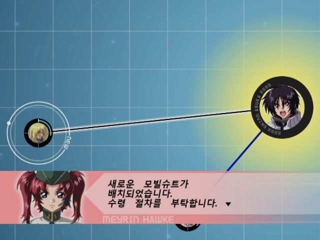
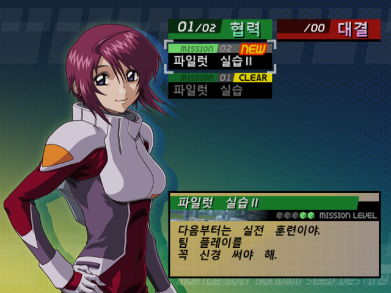
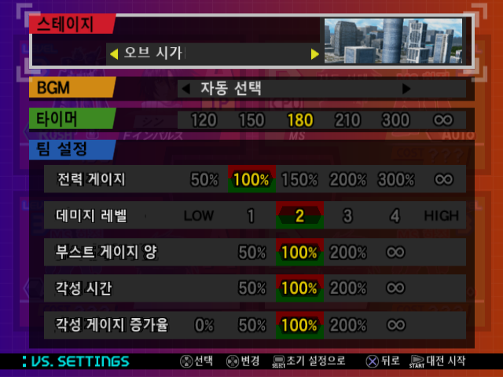
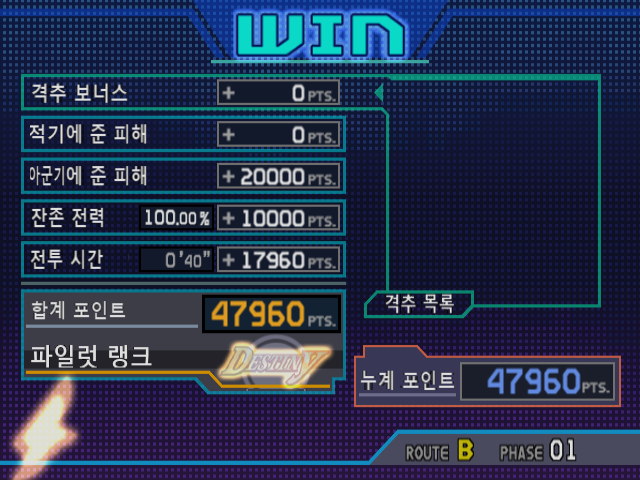

# 기동전사 건담 SEED DESTINY 연합 vs. Z.A.F.T. II PLUS — 한글 패치

PS2 『機動戦士ガンダムSEED DESTINY 連合 vs. Z.A.F.T. II PLUS』(SLPS-25718) 한국어 패치.

**v0.5** · 2026-08-12

**이 리포에는 패치 파일만 있습니다.** 게임 이미지는 들어 있지 않고, 앞으로도
올라가지 않습니다. 본인이 가진 정품 디스크의 덤프에 씌워 쓰세요.

---

## 화면

| | |
|---|---|
| <br>메인 메뉴 | <br>P.L.U.S. 지도 |
| <br>P.L.U.S. 미션 선택 | <br>브리핑 |
| <br>VS SETTINGS | <br>결과 |

스크린샷은 작업 도중 찍은 것이라 빌드가 조금씩 다릅니다. 파일럿 이름은 현재
빌드에서 한글로 나옵니다.

---

## 받는 것

| 파일 | 크기 | SHA-256 |
|---|---|---|
| `GundamSEEDDestiny_VS_ZAFTII_Plus_KR_v0.5.xdelta` | 8,273,079 B | `1efc5bfb551ada7adb987bbbf1247e11532fc881faad456f606400d7600b8acd` |

## 씌울 대상 (일본판 원본 ISO)

| 항목 | 값 |
|---|---|
| 크기 | 4,137,877,504 B |
| MD5 | `b69812eb4014a234a4653baa9966c368` |
| SHA-256 | `8ebc19acbaaaa5f816b73079083003469cc11c49f7cd7709937b4cff13522cd3` |

**해시가 다르면 다른 덤프입니다.** 그대로 씌우면 실행되지 않는 ISO 가 나옵니다.
덤프 방식(전체 이미지 / 트랙 분리)에 따라 크기부터 다를 수 있어요.

## 씌우는 법

### GUI — Delta Patcher (쉬움)

1. **Delta Patcher** (Marco Calautti) 또는 브라우저에서 도는
   [RomPatcher.js](https://www.marcrobledo.com/RomPatcher.js/) 를 엽니다.
2. `Original file` 에 원본 ISO, `XDelta patch` 에 이 `.xdelta` 파일을 고릅니다.
3. `Apply patch` 를 누릅니다.

### CLI — xdelta3

```
xdelta3 -d -f -s "원본.iso" GundamSEEDDestiny_VS_ZAFTII_Plus_KR_v0.5.xdelta "한글판.iso"
```

## 씌운 뒤 확인

결과 ISO 가 아래와 같아야 합니다.

| 항목 | 값 |
|---|---|
| 크기 | 4,137,877,504 B (원본과 같음) |
| MD5 | `5b8195770480efb76c1af9116046980c` |
| SHA-256 | `5d7bf5fcc9529c7c82fe045add384916a005aba8515b26311e0b3beae08a364a` |

```
certutil -hashfile "한글판.iso" SHA256      # Windows
sha256sum "한글판.iso"                       # Linux / macOS
```

이 값이 다르면 원본이 다르거나 패치가 제대로 안 씌워진 것입니다. 게임을 켜 보기 전에
먼저 확인하세요.

---

## 무엇이 한글이 됐나

- 메인 메뉴 / 옵션 / 게임 설정 / 버튼 설정
- 아케이드 전 구간 — SELECT ROUTE·MOBILE SUIT·PILOT, BRIEFING, 결과, SCORE RANKING
- VS 모드 — SELECT, SETTINGS, REPORT
- P.L.U.S. 모드 — 프롤로그, 지도, CHARACTER DATA, 미션 브리핑, 부대 편성
- CHALLENGE 모드 전 구간
- 전투 중 콕핏 HUD, 기체 로딩 화면, 무기 설명
- 갤러리 (인물·기체 소개 본문 포함)
- 메모리카드 안내문, 이름 입력 자판
- 파일럿 이름 (짧은 이름·풀네임 모두)

**기체 이름은 일본어 그대로 둡니다.** 기체명 문자표를 건드리면 다른 화면이 깨지는
구조라, 원문 표기를 유지하는 쪽을 골랐습니다.

세이브 데이터 제목은 **PS2 본체 메모리카드 브라우저**가 그리는 자리라 한글 글꼴이
없습니다. 번역하면 오히려 깨져서 원문으로 뒀습니다.

## 알려진 것

- v0.5 는 다듬기가 아직 남은 빌드입니다. 글자가 눌리거나 자리가 살짝 어긋난
  칸이 남아 있을 수 있어요.
- 2P 결과 화면과 일부 콕핏 표시(차지 중 등)는 **실기로 직접 띄워 보지 못하고**
  텍스처 대조로만 확인했습니다.

깨진 화면을 만나면 **화면 사진**과 **어떻게 그 화면까지 갔는지**를 이슈로 올려
주세요. 사진 한 장이면 대개 어느 글자·어느 시트인지 짚어낼 수 있습니다.

## 안내

- 이 패치는 팬 번역이며 반다이남코엔터테인먼트와 무관합니다.
- 패치 파일에는 원저작물이 들어 있지 않습니다. 게임 이미지는 직접 준비하세요.
- 개인적인 용도로만 사용해 주세요. 패치를 적용한 ISO 를 재배포하지 마세요.

글꼴은 [둥근모꼴 (NeoDunggeunmo)](https://github.com/Dalgona/neodgm) (OFL-1.1) 을
바탕으로 만들었습니다.
